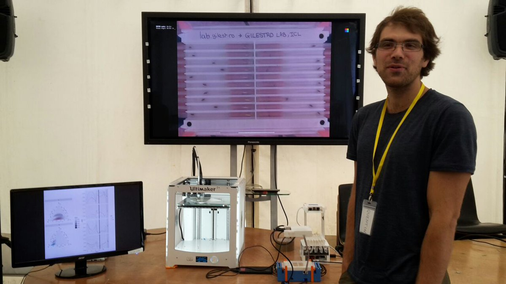

--- 
title: "Quentin Geissmann, `r Sys.Date()`"
site: bookdown::bookdown_site
output: 
  bookdown::gitbook:
    includes:
       in_header: my-header.html
documentclass: book
link-citations: yes
github-repo: qgeissmann/qgeissmann.github.io
description: "My professional webpage"
---

# About {-}

<!-- 
Presenting the ethoscope at an outreach event, 2017
 -->

Hey there, I am Quentin, a final year PhD student in in the [Gilestro lab](https://lab.gilest.ro/) (in Imperial College London). My scientific interests are both in *comparative physiology* and *computational biology*.

Indeed, I have always been interested in the diversity of life forms, and how different organisms have evolved solutions to a wide range constraints.

Over the years, I also developed a passion for open-source software which naturally led me to study computational biology, statistics and machine learning.

I am currently part of a multidisciplinary team where I work right at the intersection between my two interests.
My collaborators and myself try to understand the *physiology of sleep*, using *Drosophila* as a model.
So far, my main contributions have been to:

* Build the [Ethoscope Platform](https://gilestrolab.github.io/ethoscope/), a real time tracking system that can monitor hundreds of animals at a time
* Develop [Rethomics](http://rethomics.github.io/), a pipeline to analyse high-throughput behaviour data
* Use these approaches to challenge our understanding of sleep (*e.g.* physiology of sleep deprivation, trade-offs between sleeping and mating)
